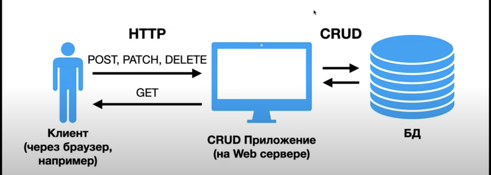
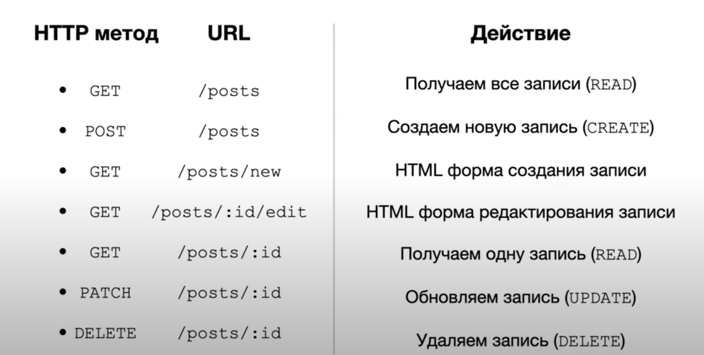
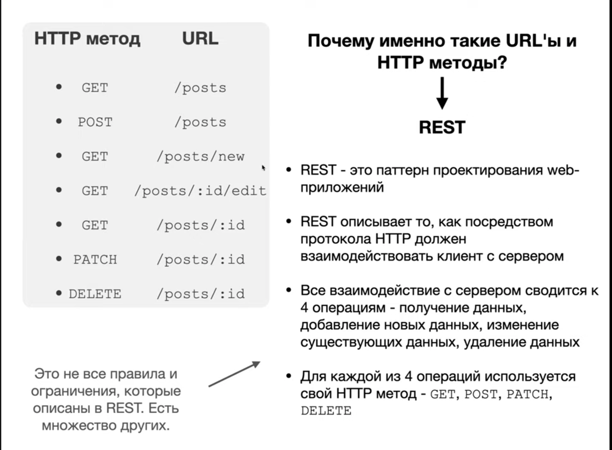
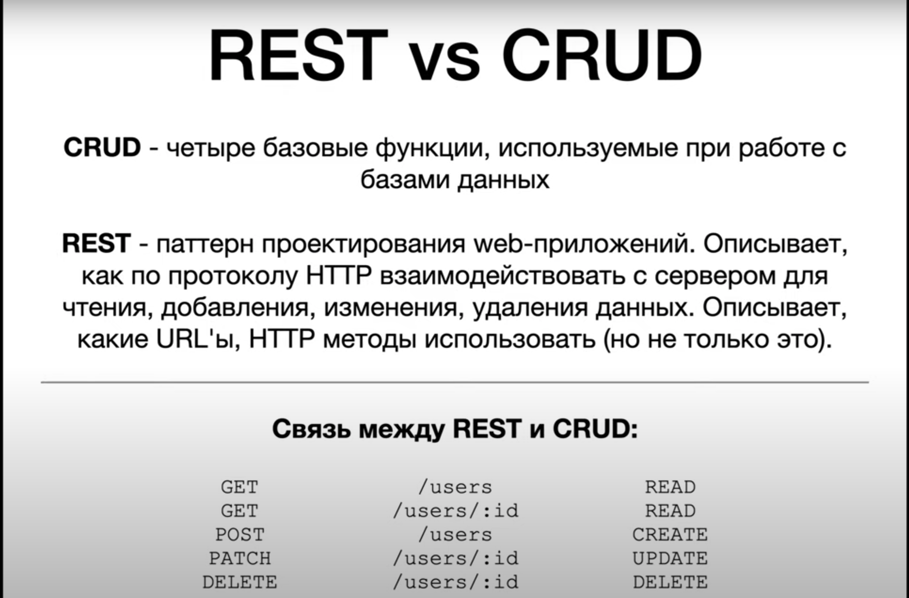
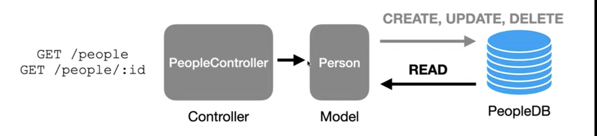
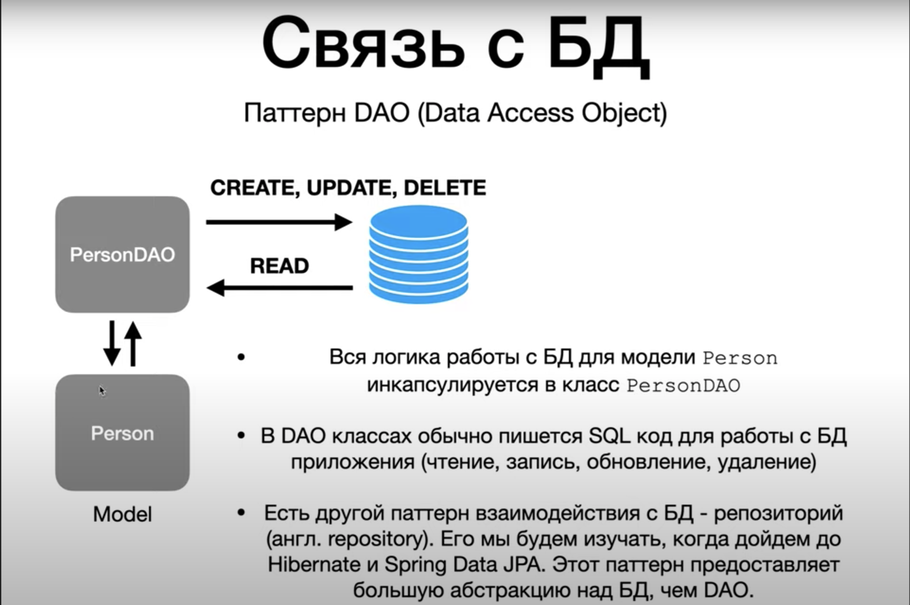
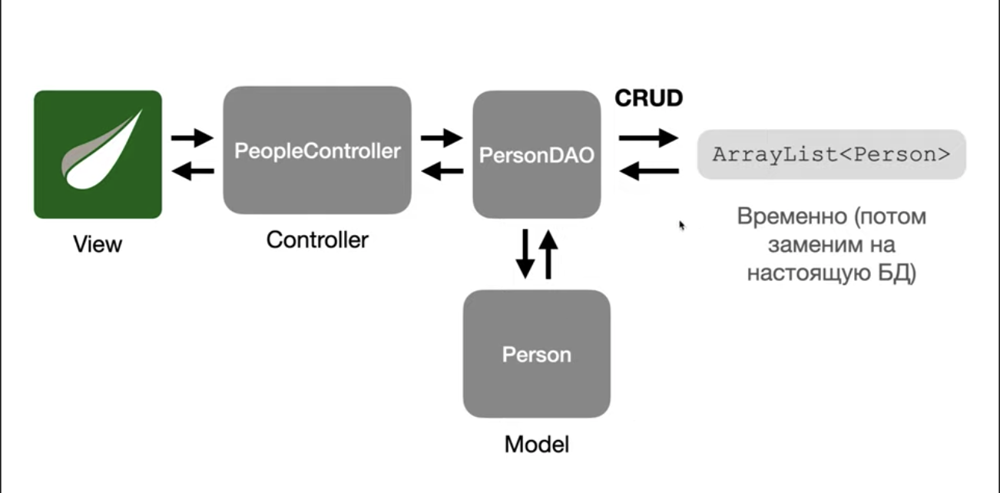
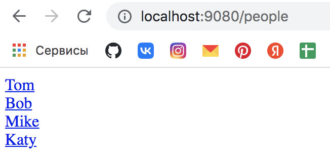
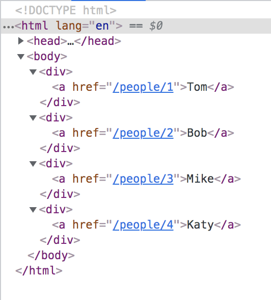

# Spring MVC (CRUD, REST, Паттерн DAO (Data Access Object))

CRUD - стандартная классификация функций по манипуляции данными.
Четыре базовые функции, используемые при работе с БД: CREATE, READ, UPDATE, DELETE.
CRUD приложение - это приложение, которое позволяет добавлять (CREATE), читать (READ), обновлять (UPDATE) и удалять (DELETE) данные. 
Чаще всего CRUD приложения являются Web-приложениями. То есть доступ к БД предоставляется через протокол HTTP.
Большинство Web-приложений - CRUD-приложения.

Пример CRUD'а для сущности Post:

DAO (Data Access Object) - паттерн проектирования, когда отдельный класс занимается взаимодействием с БД для конкретной сущности.

## Задание

1. Начнем реализовывать CRUD приложение для сущности Person. 
2. Реализуем операцию READ. 

3. Вынесем логику взаимодействия с БД из самой модели в отдельный класс. 

4. Так должно выглядить наше CRUD-приложение в конечном варинте:

## Решение

1. Реализуем контроллер - `PeopleController`.
2. Реализуем два метода в контроллере - `index` с пустым `@GetMapping` (будем передавать на отображение в представление всех полученных в методе людей из DAO при переходе на `/people`, указанном  в `@RequestMapping` у контроллера) и получающим на вход`Model`; и второй метод - `show`, который принимает на вход `id` и у которого `@GetMapping("/{id}")` (с помощью аннотации `@PathVariable` мы извлекаем `id` из url'а (указан в `@GetMapping`) и получаем к нему доступ внутри этого метода), а также метод тоже будет принимать `Model` для реализации шаблона через Thymeleaf.
3. Реализуем модель - класс `Person`.
4. Реализуем DAO - класс `PersonDAO`, он будет общаться со списком и будет извлекать из списка, находить конкретного  человека по id и т.д.
5. `++PEOPLE_COUNT` - автоматизирует увеличение `id` при добавлении в `List<Person>`.
6. В DAO два метода создаем - `index` (возвращает весь список людей) и `show` (возвращает одного человека).
7. В контроллере для чтения DAO внедряем объект DAO в контроллер (для этого помеяаем DAO аннотацией `@Component` для создания бина, а в контроллере заводим поле `personDAO` с аннотацией `@Autowired`(но выскакиет подсказка от среды разработки, что лучше внедрять через конструктор - так и делаем)).
8. Реализуем методы `index` и `show`.
9. Реализуем представление, отображающее список из людей - `index`.
10. В теге `<html>` после `<lang="en"` обязательно надо не забыть указать, что используем Thymeleaf - `xmlns:th="http://thymeleaf.org"`.
11. Для того, чтобы в представлении пройттись по всему списку людей, в Thymeleaf'е есть что-то вроде цикла - `th:each=""` (в данном случае - создаем временную переменную `people` и проходясь по `${people}` кладем в нее значение).
12. Указываем в `
` тег `<a>`, где прописываем `th:text="${person.getName()}"`, а получившееся имя динамически Thymeleaf перезапишет вместо `user`, указанного у наса в разметке.
13. Добавляем в тег `<a>` ссылку, чтобы при нажатии переходилось на страницу выбранного человека, - `th:href="@{/people/{id}(id=${person.getId()})}"`.
14. Получилось, что в теге `<a>` Thymeleaf будет динамически создавать страницы с id, указанном у пользователя, а при переходе на нее будем поподать в метод `show` контроллера.
15. Реализуем представление, отображающее определенного человека - `show`.
16. Пишем теги `
`, где будем отображать имя и id (`value` также динамически будет перезаписываться).
17. Запускаем приложение: 
    1. `localhost:9080/people` , при этом код страницы получился 
    2. Нажимаем на `Tom` - `localhost:9080/people/1` 