# Spring MVC (CRUD приложение. PATCH, DELETE запросы)

HTML 5 предполагает использование только GET и POST, хотя HTTP-методов много.
Для использования PATCH и DELETE могли бы все делать через POST, но хочется использовать возможности протокола HTTP.
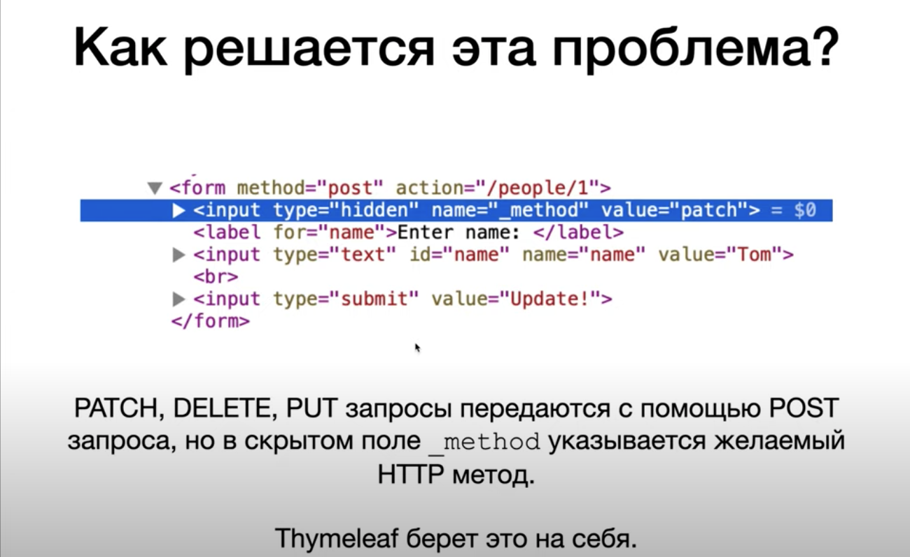
Скрытое поле - поле, которое не видно в браузере и значения которого нельзя помпенять с помощью браузера.
Именно по значению, указанному в `value` (`value="patch"`), и `name="_method"` Spring понимает, что мы хотим использовать метод PATCH.
Если используем формы в Thymeleaf'е, то создание скрытого поля Thymeleaf берет на себя - мы вручную его не создаем.

На стороне Spring-приложения чтение скрытого поля `_method` реализуется с помощью фильтра.
Фильтр - объект, который перехватывает все входящие HTTP-запросы. В данном случае фильтр используется для того, чтобы смотреть на значение поля `_method` в поступающих HTTP-запросах (если это поле есть).
Сейчас подключим фильтр вручную. В Spring Boot это будет делаться с помощью одной строки в конфигурационном файле.

## Задание

1. Реализуем PATCH и DELETE.
2. При GET-запросе (`/people/:id/edit`) будет показана страница обновления человека.
3. При PATCH-запроск (`/people/:id`) будет обновляться данные человека с указанным id.
4. При DELETE-запросе (`/people/:id`) будет удаляться человек с указанным id.

## Решение

1. Создадим страницу для редактирования человека. Для этого создадим метод в контроллере `edit()`, который на вход принимает Model, и у которого с помощью `@PathVariable` мы извлекаем id.
2. В модель в методе `edit` положим то, что вернется из `personDAO` по id (вернется человек с указанным id), так как мы не хотим, чтобы поля были пустые, мы хотим, чтобы в полях уже были значения текущего человека.
3. Создадим представление `edit.html`.
4. В представлении использует Thymeleaf'овский метод (`th:method`), поэтому указываем метод PATCH. В этом случаем Thymeleaf возьмет значение PATCH, создаст скрытое поле `_method` и в это скрытое поле поместит значение PATCH. Если использовать обычный HTML-метод (`method`), то у такого метода нет PATCH'а, есть только GET и POST.
5. Реализуем метод в контроллере, который будет принимать PATCH-запрос на адрес `/people/:id`, - `update`.
6. Метод `update` должен найти из БД человека с таким id и поменять его значения из формы, то есть на те значения, которые лежат в этом объекте класса `Person`, который мы получили с помощью `@ModelAttribute`. Это мы будем делать в DAO с помощью его метода `update`, который будет принимать id и этого человека, то есть человека, который пришел из формы `edit`.
7. Реализуем метод `update` в `personDAO`.
8. Ищем человека с помощью `show`, передаем ему id. Найденного человека помещаем в переменную.
9. У найденного человека необходимо обновить поле `name` тем полем, которое пришло от человека, который пришел у нас с формой редактирования, то есть с формы `edit`. Для этого у найденного человека через сеттер устанавливаем имя, полученное через геттер у человека, пришедшего на вход метода.
10. Запускаем сервер:
    - переходим на `localhost:9080/people/2/edit` 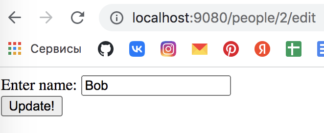
    - html этой страницы отображает скрытое поле `_method` 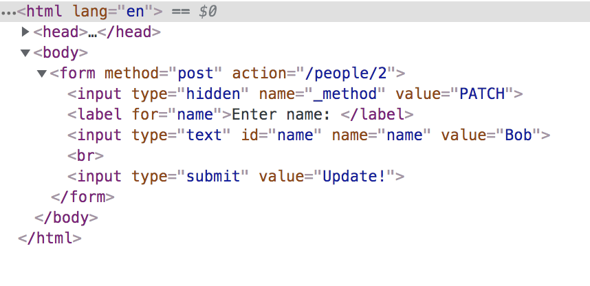
    - вводим Bobby и нажимаем `Update!` 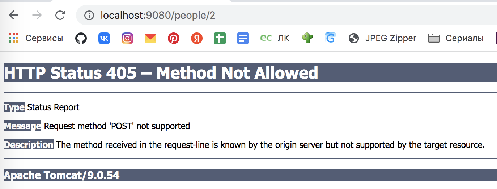
    - ошибка потому, что на стороне Spring'а мы пока не обрабатываем скрытое поле, поэтому Spring считает, что эту форму мы отправили с помощью POST-запроса. И так как у нас нет метода контроллера, который бы обрабатывал POST-запрос на этот адрес, возникает эта ошибка;
11. Реализуем на стороне Spring'а чтение значения из этого скрытого поля и направление запроса на нужный метод контроллера. Для этого создаем фильтр.
12. Переходим в класс `MySpringMVCDispatcherServletInitializer` и там добавляем фильтр (`onStartup` & `registerHiddenFieldFilter`).
13. `onStartup` запускается при старте Spring-приложения, здесь мы выполняем приватный метод `registerHiddenFieldFilter`, в этом приватном методе мы добавляем к нашему приложению один фильтр (достаточно для PATCH и DELETE запросов) - `HiddenHttpMethodFilter()`, то есть мы сами не реализуем фильтр, он уже есть в Spring'е, мы просто его добавляем к нашему приложению. Это фильтр смотрит на значение скрытого поля `_method`, смотрит, какой там HTTP-метод находится, перенаправляет входящие HTTP-запросы на нужные методы контроллера.
14. Перезапускаем сервер:
    - переходим на `localhost:9080/people/2/edit` 
    - вводим Bobby и нажимаем `Update!` 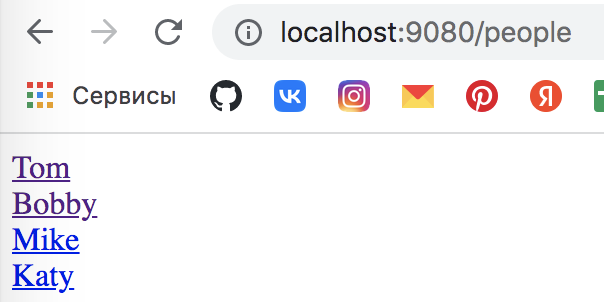
15. Создадим кнопку перехода на страницу редактирования для человека - в `show.html` добавляем ссылку.
16. Добавим кнопку удаления человека. С помощью тега `<a>` мы не можем посылать DELETE-запрос, поэтому используем форму `<form>`.
17. Релизуем метод контроллера, принимающего DELETE-запрос, - `delete`.
18. Добавим кнопку для перехода на страницу создания нового человека на странице всех пользователей.
19. `
` создает горизонтальную линию.
20. Запускаем приложение:
    - `/people` 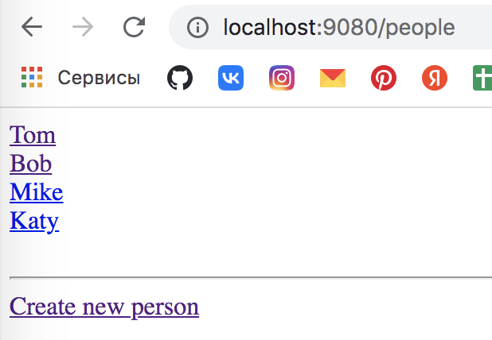
    - нажимаем `Create new person` - `/people/new` 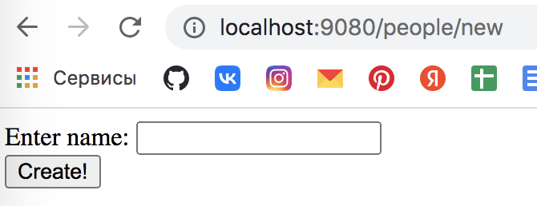
    - создаем и жмем `Create` - `/people` 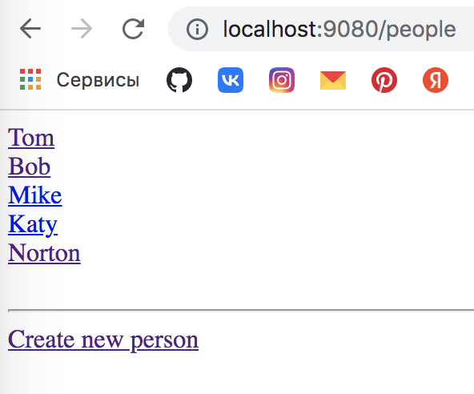
    - нажимаем на любого человека, например, `Mike` - `/people/3` 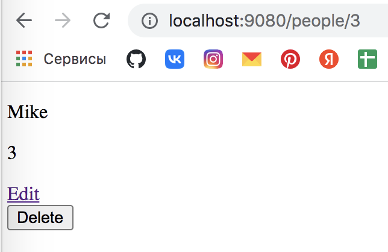
    - нажимаем `Edit` - `/people/3/edit` 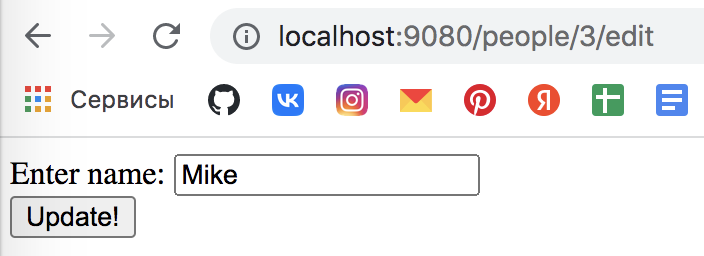
    - вводим `Mike Johnston` и жмем `Update` - `/people` 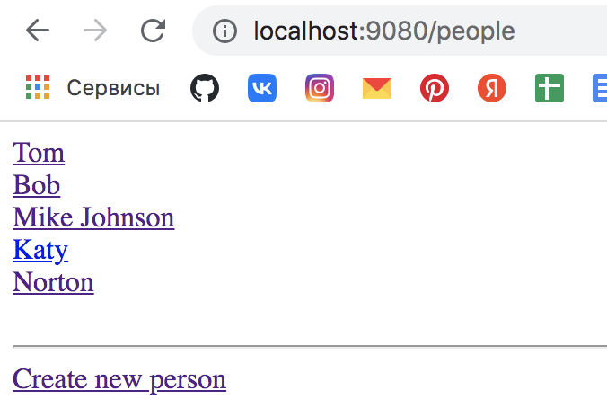
    - переходим снова на страницу человека - `/people/3` 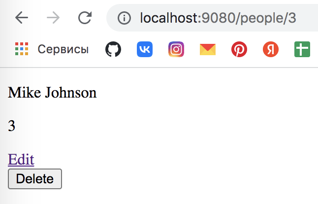
    - жмем `Delete` - `/people` 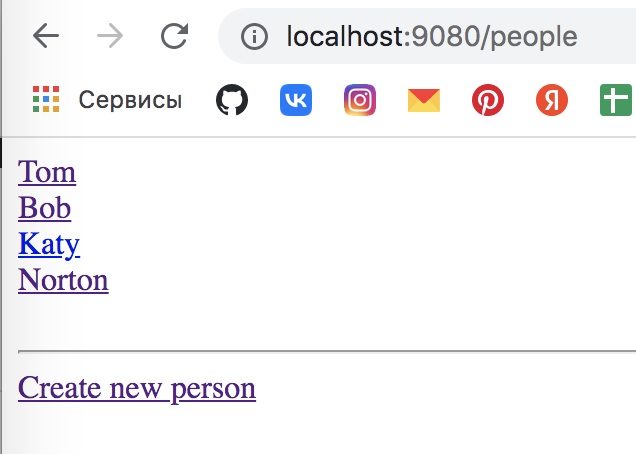