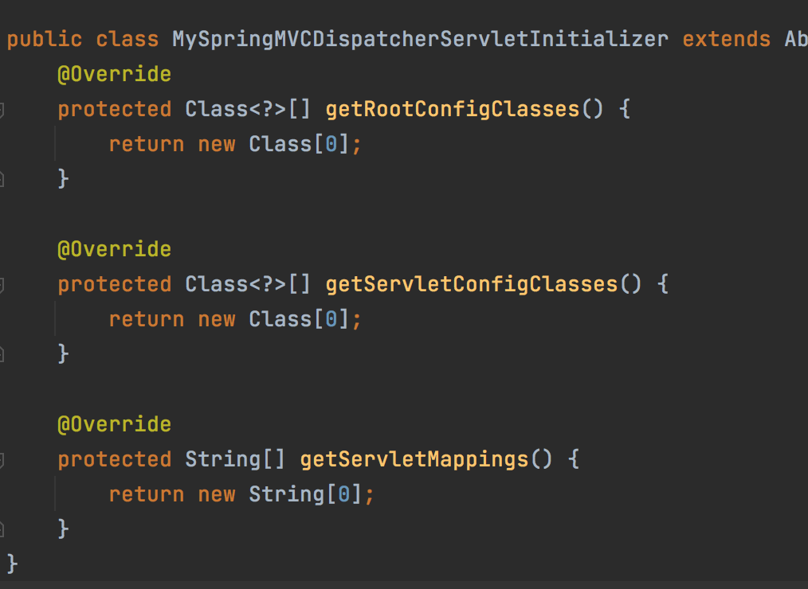

# Spring MVC (SpringConfig.java)

## Задание

1. Сделать конфигурацию Spring MVC-приложения с помощью java-кода

## Решение
1. Будем заменять файлы `web.xml` и `applicationContext.xml` на java-классы.
2. Начиная с 3 версии Spring Framework можно использовать Java-код вместо `web.xml`. Для этого необходимо в проекте создать класс, который реализует интерфейс `org.springframework.web.WebApplicationInitializier`. Такой класс считывается автоматически и работает как `web.xml`.
3. В классе, заменяющем `web.xml`, должен быть перезаписанный метод `onStartup`, в котором будет код, заменяющий код в `web.xml`.
4. Но мы будем использовать другой метод замены `web.xml` - абстрактный  класс, который реализует интерфейс `WebApplicationInitializier` за нас.
5. Создаем класс, которым заменяем `web.xml` - `MySpringMVCDispatcherServletInitializer`, который должен наследоваться от абстрактного класса `AbstractAnnotationConfigDispatcherServletInitializer`.
6. Имплементируем все методы этого класса (правая клавиша - implement methods): .
7. В этих методах должны передать конфигурацию (11 пункт).
8. Создаем класс, заменяющий `applicationContext.xml` - `SpringConfig` с необходимыми аннотациями + `@EnableWebMVC`, так как создаем приложение, которое поддерживает веб-функции (она равнозначна `<mvc:annotation-driven/>`, которая была в `applicationContext.xml`).
9. В `SpringConfig` реализуем бины, которые отвечали за реализацию шаблонизатора. 
10. Мы реализуем интерфейс `WebMvcConfigurer` через `SpringConfig`, и вместе с этим  реализуем метод `configureViewResolvers`. Этот интерфейс реализуется тогда, когда мы хотим под себя настроить Spring MVC, и в данном случае мы хотим вместо сандарттного шаблонизатора использовать Thymeleaf. Поэтому в упомянутом методе мы задаем шаблонизатор. Также внедряем applicationContext - он будет внедрен самим Spring'ом за нас. Этот applicationContext мы используем в бине `templateResolver`, задаем папку, где лежат представления, и расширение представлений. С помощью бина `templateEngine` производим конфигурацию наших представлений.
11. Возвращаемся в `MySpringMVCDispatcherServletInitializer` и теперь поставим недостоющие значения:
- `getRootConfigClasses` использовать не будем - меняем на `return null`;
- в `getServletConfigClasses` должны подставить конфигурационный класс `SpringConfig` - `return new Class[] {SpringConfig.class}`;
- в `getServletMappings` прописываем `return new String[] {"/"}` - это все HTTP-запросы от пользователя посылаем на DispatcherServlet.
12. Осталось добавить одну зависимость - `Java Servlet API` - она используется абстрактным классом, интерфейс которого мы реализовали в `MySpringMVCDispatcherServletInitializer`.
13. Удаляем xml-файлы и запускаем сервер.