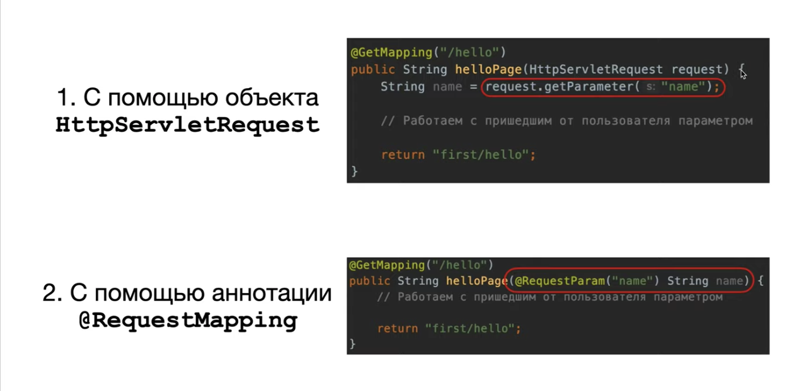

# Spring MVC (@RequestParam)

1. Запросы в Spring Framework можно обрабатывать 2мя способами: с помощью объекта `HttpServletRequest` и с помощью аннотации `@RequestParam`. 
2. Первый метод будет удобнее, если нужно работать с несколькими данными из запроса, второй - если достаточно одного параметра.

## Задание

1. Разбираемся, как с Get-запросом передавать параметры на сервер и как на сервере с помощью Spring эти параметры можно обрабатывать.

## Решение

1. Будем передавать с Get-запросом параметры.
2. Для того, чтобы эти параметры обрабатывать, внедряем в контроллер `httpServletRequest` (используем один контроллер - `FirstController`).
3. Получим из запроса два параметра - `name` и `surname`.
4. Сделаем вывод в консоль приветствия.
5. Запускаем сервер и передаем параметры - `localhost:9080/first/hello?name=Tom&surname=Jones` - в консоли отображается приветствие.
6. Если делать Get-запрос в браузере без параметров (`localhost:9080/first/hello`), то в консоли будет выведено `Hello, null null`.
7. Сделаем получение через `@RequestParam`. 
8. Запускаем сервер и передаем параметры - `localhost:9080/first/hello?name=Tom&surname=Jones` - в консоли отображается приветствие. 
9. Если делать Get-запрос в браузере без параметров (`localhost:9080/first/hello`), то в браузере будет ошибка 400 - Bad Request: `Message Required request parameter 'name' for method parameter type String is not present`, а в консоли не будет выведено ничего. 
10. Чтобы не было обязательства передавать параметры (чтобы не было 400 ошибки), добавляем в `@RequestParam` конструкцию `@RequestParam(value = "name", required = false)"` (реализовано в `goodbyePage`).
11. В случае `required = false` выводится в консоль также - `Hello, null null`.
12. Добавим ссылку на страницу `goodbye.html` с указанием передаваемых параметров параметров.
13. При нажатии на ссылку выводится в консоль приветсвие.
