# Spring MVC (SQL инъекции. PreparedStatement. JDBC API)

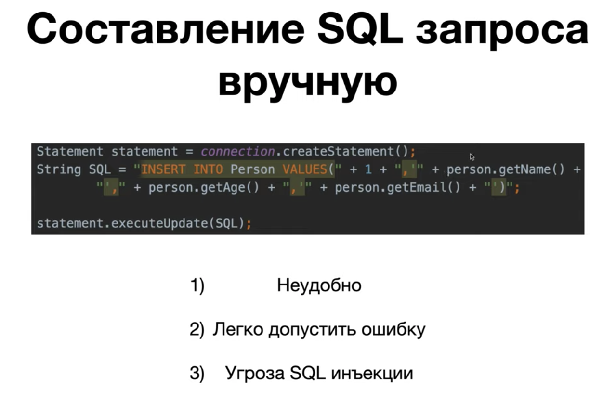
SQL инъекция - один из самых распространенных способов взлома сайтов и программ, работающих с БД.
Так как строки из HTML формы напрямую конкатенируются в SQL запросе, злоумышленник может подобрать такую строку, которая нанесет вред.
Например, при вводе email введется `test@mail.ru'); DROP TABLE Person; --`, получится `INSERT INTO Person VALUES (1, 'test', 15, 'test@mail.ru'); DROP TABLE Person; --')` и таблица удалится.
`--` в SQL == `//` в Java.
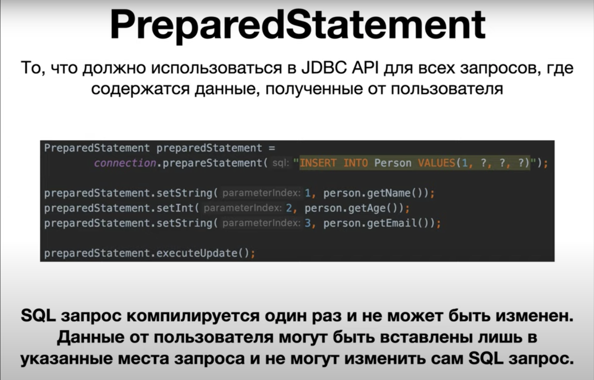
Если опять в качестве email введем строку `test@mail.ru'); DROP TABLE Person; --`, то вся эта строка будет помещена как email.
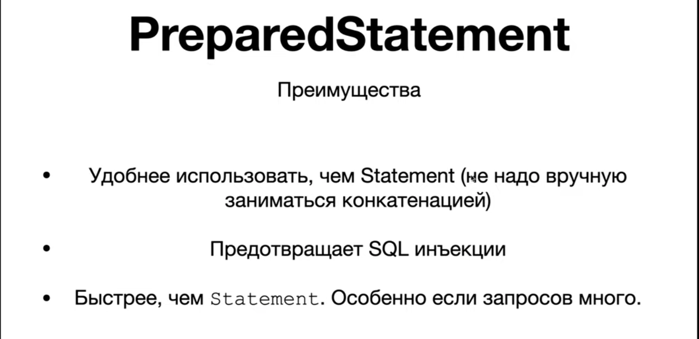
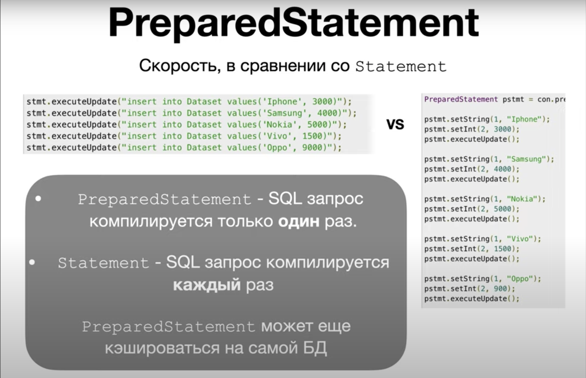

## Задание

1. Решим проблему SQL инъекции с помощью класса PreparedStatement.
2. Перепишем метод `save` и реализуем оставшиеся методы в DAO.

## Решение

1. Метод `index` переписывать не будем, так как в нем мы не берем данные от  пользователя и не вносим изменений в БД.
2. Перепишем метод `save`.
3. Реализуем методы `show`, `update` и `delete`.
4. Запускаем приложение:
   - `/people` - 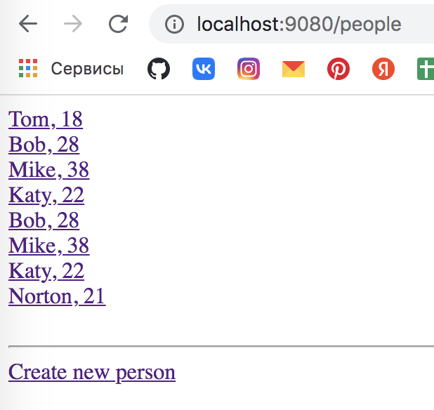
   - `/people/new` - 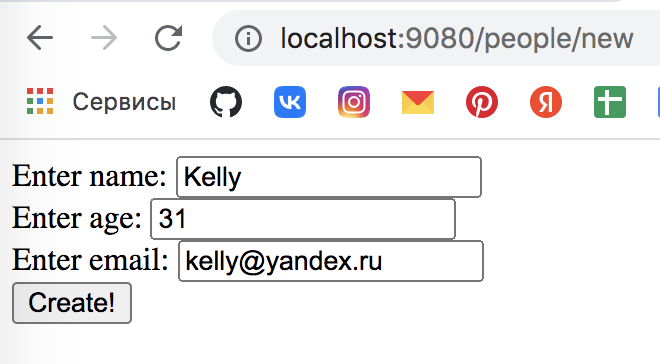
   - жмем `Create!` - `/people` - 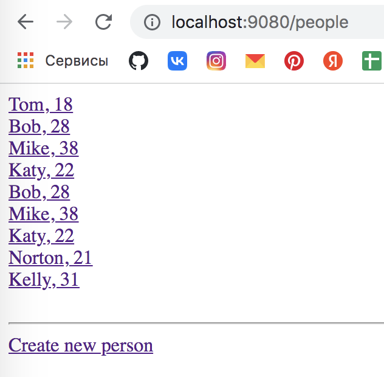
   - `/people/1` - 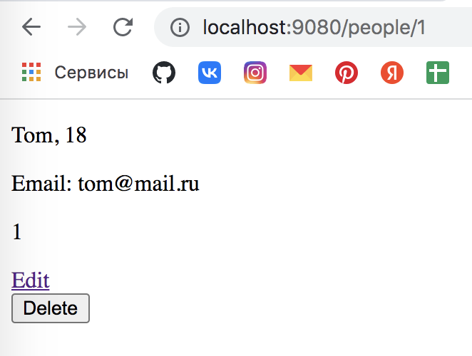
   - `/people/1/edit` - 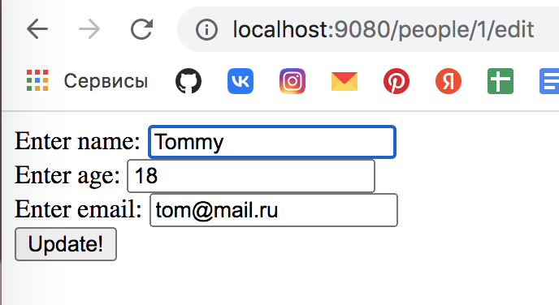
   - жмем `Update!` - `/people` - несколько человек обновилось (у кого id = 1), так как захардкодили id - 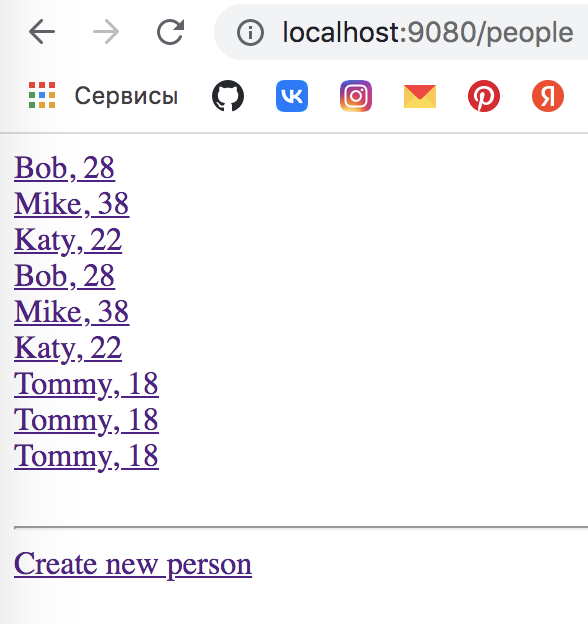
   - `/people/1` -> `Delete` - `/people` - 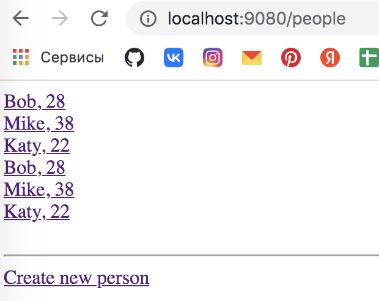
   - 