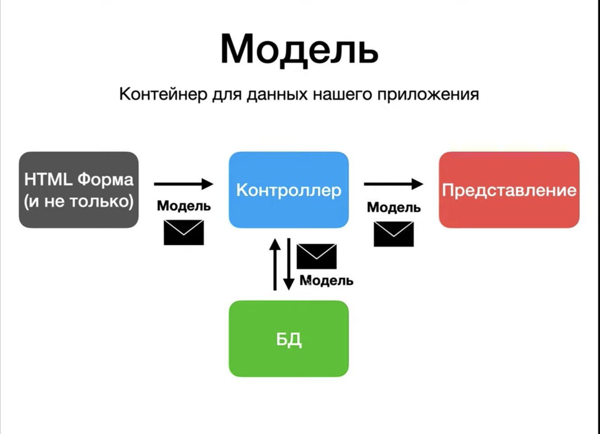
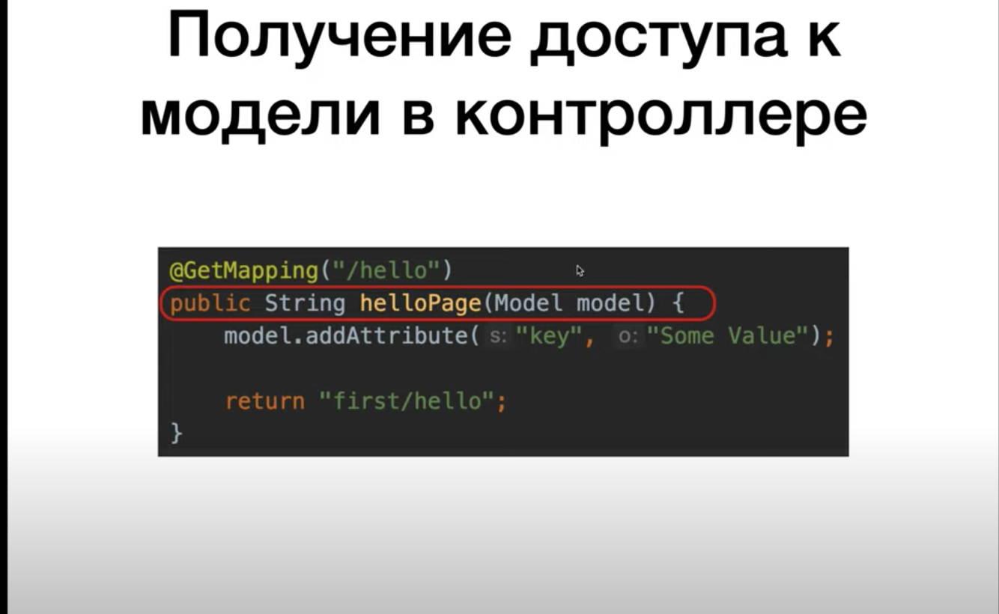
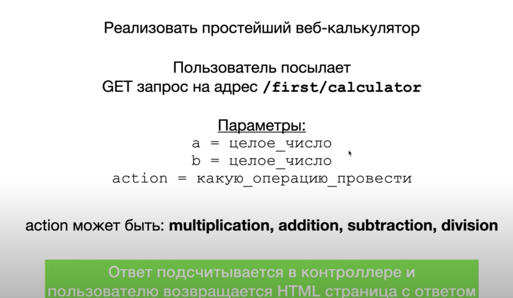

# Spring MVC (Модель)

## Задание

1. Передача данных от контроллера к представлению.
2. Решим задачу 

## Решение

1. Работаем с `helloPage` - пишем в параметрах `Model model`.
2. Обращаемся к моделе и кладем пару ключ-значение с помощью метода `addAttrinute`.
3. В представлении с помощью Thymeleaf'а обращаемся к значению по ключу - `p th:text`.
4. `th:text` - аттрибут Thymeleaf'а, который позволяет вставить текст в тег `p`. Thymeleaf увидит код, обратится к моделе и по ключу `message` вставит этот текст.
5. Заупскаем сервер и передаем параметры - отображается `Hello, Tom Jones` в браузере.
6. Решаем задачу 2.
7. Реализуем новый метод в контроллере - `calculator`.
8. Реализуем представление `calculate`.
9. Запускаем и передаем параметры - все ок.
10. При пустых значениях и невалидном значении  `action` отображается ошибка.
