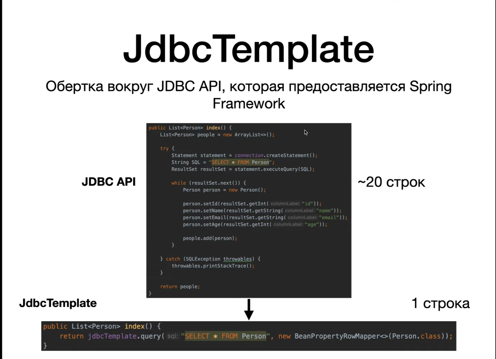
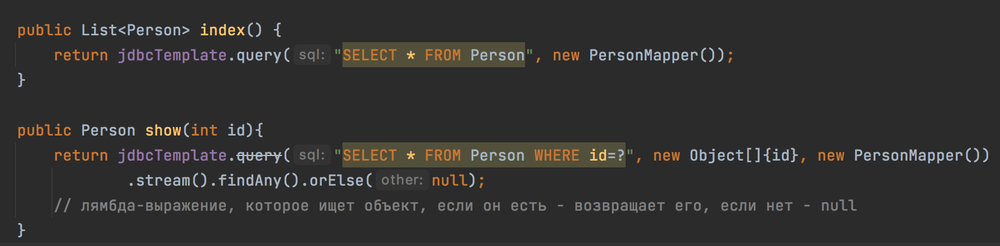
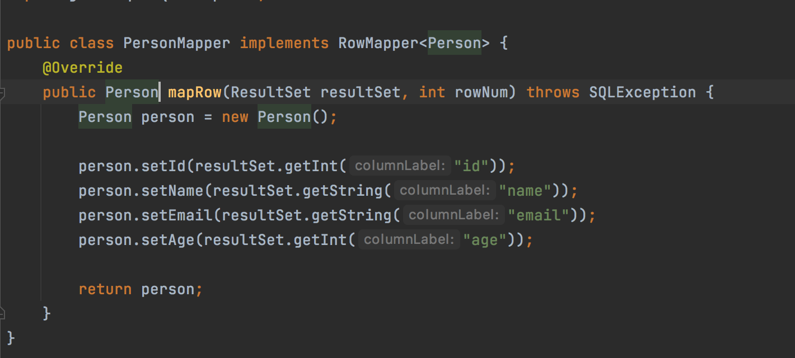

# Spring MVC (JdbcTemplate)

Тонкая обертка вокруг JDBC API, упрощающая работу с БД.
Проблемы JDBC API:
- много лишнего кода (создание `Connection`, `Statement`, работа с `ResultSet`);
- дублирование когда (например, в методе `index` и `show`);
- неинформативный SQLException, который надо везде обрабатывать;

## Задание

1. Перепишем DAO, используя JDBC Template.

## Решение

1. Добавим зависимость `Spring Jdbc`.
2. Чтобы использовать JDBC Template создаем с помощью Spring'а объект - бин в классе `SpringConfig`.
3. `DataSource` - бин нужен JDBC Template'у, чтобы указать, к какой БД подключаться.
4. Создаем бин JDBC Template и указываем бин `DataSource`.
5. Переписываем DAO с учетом JDBC Template'а.
6. Создаем поле JdbcTemplate, внедрим его с помощью `@Autowired`.
7. Удаляем все,  связанное с подключение к БД, так как теперь этот код не нужен.
8. Переписываем `index`, в нем делаем запрос с помощью JDBC Template, используя метод `query`, которому передаем SQL-запрос и роу-маппер (это объект, который  отображает строки из таблицы в  нашей сущности, то есть каждую строку из таблицы БД, полученную по нашему запросу, он отобразит в объект класса Person).
9. Реализуем роу-маппер - `PersonMapper`, реализующий интерфейс `RowMapper` из пакета `org.springframework.jdbc.core`.
10. `RowMapper` мы подлжны параметризовать - указать, что мы преобразуем строки таблицы именно в объект класса Person.
11. В этом интерфейсе есть только одна сигнатура метода `mapRow`, в которой мы должны из нашего ResulSet'а брать одну строку и переводить ее в объект класса Person (по сути, копируем ранее написанный дублирующий код для `index` и `show`).
12. Реализуем метод `show`.
13. У JDBC Template всегда по-умолчанию используется PreparedStatement.
14. Второй аргумент будет массив из значений, которые будут подставлены в наш запрос на место вопросительного знака.
15. Третий аргумент - PersonMapper.
16. Появдяется ошибка, так как должны возвращать одного человека, а возвращаем список.
17. Список, по идее, должен быть из одного человека, либо пустым, так как id должно быть уникально.
18. Чтобы у нас возвращался либо человек, либо null, используем лямбда-выражение, которое ищет объект в списке `.stream()`.
19. В итоге -  
20. Пойдем еще дальше - еще упростим код, используя готовый RowMapper (так как мы делаем тривиальные вещи - с помощью сеттеров назначаем полям с такими же названиями значения).
21. Удаляем наш маппер и используем в методах `BeanPropertyRowMapper`, а в качестве аргумента в конструктор передаем ему наш класс.
22. Переписываем оставшиеся методы в DAO.
23. В методе `save` используется `update` вместо `query`, который принимает на вход только запрос и var-arg (`Object... arg`).
24. Запускаем - все работает как раньше.