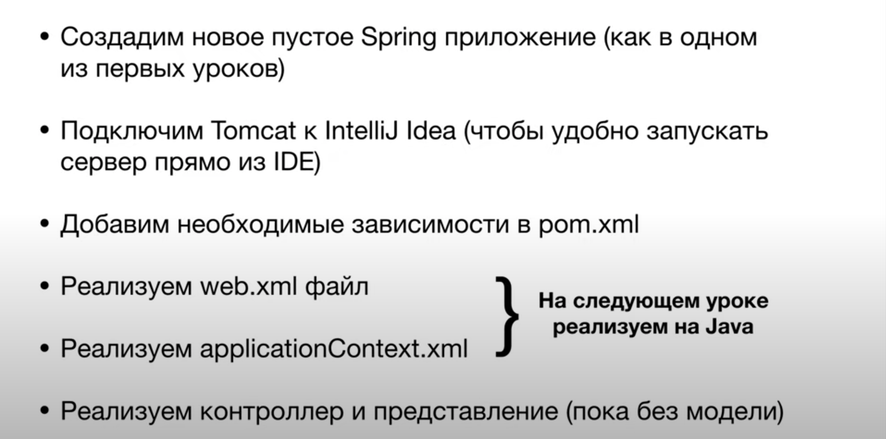

# Spring MVC (first application)

## Задание

## Решение
_плагин возможно установить только на платной версии, есть варианты подключения плагина через pom.xml и запцуск сервера через консоль_

1. Устанавливаем Tomcat http://tomcat.apache.org/
2. Указываем путь к скаченной разархивированной папке в среде разработки: Run -> Edit Configurations -> "+" -> Tomcat Server -> Local -> Application server -> Configure -> "+" -> Tomcat Home -> Выбираем директорию -> Fix -> :war exploded -> Application context -> " ". (Я поменял хост с 8080 на 8090 из-за селеноида на этом порту).
3. Запускаем сервер: Run -> Run -> Tomcat.
4. При первом запуске появляется "Error running".
5. Открываем терминал -> переходим в папку, где находится Tomcat-сервер -> `cd bin` -> мы не дали права на исполнение файла catalina.sh -> `chmod +x catalina.sh`.
6. Заново повторяем шаг 3 - `Artifact SpringMVC:war exploded: Artifact is deployed successfully`.
7. Добавляем зависимости в pom.xml - для Spring Core, Spring MVC и шаблонизатора Thymeleaf.
8. В pom.xml мы вынесли версию Spring в отдельную переменную `spring.version` в теге `<properties>` и указывали у зависимостей эту переменную.
9. Далее реализуем файл web.xml.
10. Файл web.xml считывается сервером (Tomcat), поэтому в нем описываем то, что хотим, чтобы сервер делал. Сейчас хотим, чтобы все HTTP-запросы сервер отправлял на DispatcherServlet, чтобы он уже "правильно" подбирал контроллеры для запросов.
11. С помощью тега `<servlet>` создаем наш DispatcherServlet. `<servlet-class>` берется из библиотеки Spring'а, он уже реализован за нас. `<param-value>` - путь до файла, где находится Spring-конфигурация. `<load-on-startup>` указывает, что DispatcherServlet надо запускать в первую очередь. С помощью `<servlet-mapping>` мы обращаемся к нашему DispatcherServlet и  говорим, что любой url (`<url-pattern>`), который набирает пользователь, должен направляться на DispatcherServlet.
12. Создаем applicationContextMVC.xml.
13. `<mvc:annotation-driven>` включает необходимые аннотации для Spring MVC-приложения.
14. Три бина для того, чтобы работал шаблонизатор Thymeleaf. В первом `value` отвечает за то, где лежат шаблоны и какое расширение будет (`.html`). Это позволяет в контроллере обращаться к шаблонам напрямую, не указывая путь и расширение.
15. Создадим контроллер и пометим аннотацией `@Controller` - HelloController.java.
16. Создадим метод `sayHello()`, над ним указываем аннотацию `@GetMapping`, у которой в скобках указываем, какой url будет приходить в этот метод котроллера. Метод возвращает представление.
17. Создаем представление `hello_world` - views.hello-world.html.
18. Перезапускаем сервер (в IDEA): Services -> Refresh (значок) -> Redeploy, либо Stop (значок) -> Run (значок).
