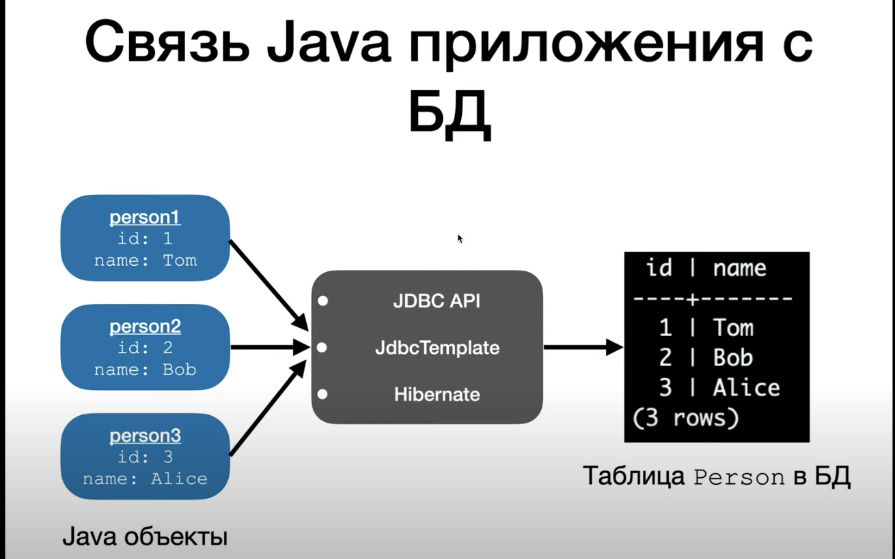
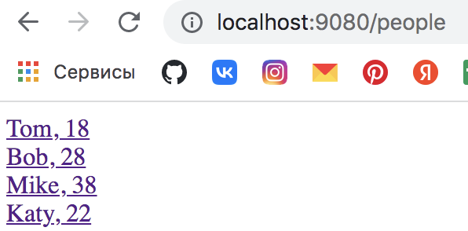

# Spring MVC (JDBC API. Базы данных)

Реалиционные БД - БД, которые хранят данные в виде таблиц.
Используем PostgreSQL, она более "навороченная", чем MySQL.
Для использования другой реляционной БД нужен будет другой JDBC драйвер).
Есть несколько спсобов связи Java-приложения с БД:

Базовые SQL-команды:

Проблема JDBC - любая ошибка (подключение к БД, связь и т.п.) будет SQLException.

## Задание

1. Подключим БД к проекту через JDBC.

## Решение

1. Устанавливаем БД.
2. Подключаем БД в IDEA:
   - нажимаем в IDEA на вкладку Database 
   - жмем "+" -> Data Source -> PostgreSQL -> вводим данные (host, user, password, database(имя)) -> Test Connection -> если ок -> Копирует строку URL -> Ok
3. В console создадим новую таблицу, после сверху слева жмем зеленый треугольниу (Execute) 
   `create table Person(`
   `  id int,`
   `  name varchar,`
   `  age int,`
   `  email varchar`
   `)`
4. Добавляем людей в таблицу в console
   `insert into person values(1, 'Tom', 18, 'tom@mail.ru')`
5. Для проверки добавления введем `select * from person` и нажмем Execute.
6. Добавляем еще троих 
   `insert into person values(2, 'Bob', 28, 'bob@mail.ru');`
   `insert into person values(3, 'Mike', 38, 'mike@mail.ru');`
   `insert into person values(4, 'Katy', 22, 'katy@mail.ru');`
   - при добавлении нескольких нужно  выделить все строки и нажать Execute.
7. Подключаем зависимость `PostgreSQL JDBC Driver`.
8. Перейдем в DAO и запишем url, name и password (лучше это делать в файле `.properties`).
9. Создаем Connection для БД.
10. `Class.forName("org.postgresql.Driver");` - подгружаем драйвер.
11. Реализуем методы `index` и `save` в DAO.
12. Объект `Statement` - тот  объект, который содержит в  себе SQL-запрос к БД.
13. `statement.executeQuery` - для выполнения на нашем стейтменте SQL-запросаю
14. Возвращается несколько строк из БД - `ResultSet` принимает их.
15. Проходимся по строкам и вручную переводим в Java-объект.
16. Получили все данные с помощью `resultSet.getInt` и `resultSet.getString`, с помощью сеттеров установили значения новому созданному объекту `Person`, теперь добавляем этого человека в список `people`.
17. Запускаем приложение 
18. Реализуем добавление людей в методе `save`.
19. В этот раз делаем запрос и указываем в строку все, что в скобках у `VALUES`, но так делать не надо.
20. Запускаем приложение:
    - `/people/new` ;
    - Жмем `Create!` - `/people` 

### Примечания из комментариев

1. ResultSet и Connection в конце надо закрывать
2. Для MySQL зависимость называется - MySQL Connector/J, `Class.forName("com.mysql.jdbc.Driver")`
3. Разве надо обрабатывать исключения в DAO? Не лучше ли пробросить их в модель и там формировать соответствующий view если, например, отвалилась БД?
4. А разве связь с базой в Spring не должен работать через services layer? Я видел что создаётся DAO интерфейсы потом реализация. Потом создают services. Services расширяют реализацию дао и создают Connection и работают с базой непосредственно. Service -> DAO -> DataBase. - да, должен. Просто я не хочу все сразу давать в одном уроке. Дойдем и до сервисов. 
5. 