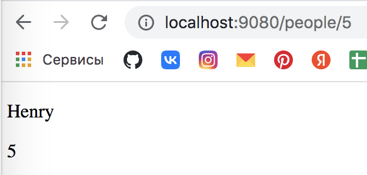

# Spring MVC (Аннотация @ModelAttribute. HTML Формы (Thymeleaf))

1. 
   1. `method` - используемый метод;
   2. `action` - куда будет отправляться данные с этой формы;
   3. `imput` - создает поле для ввода;
   4. `label` - дает понять пользователю, что вводить;
   5. `type="submit"` - кнопка подтверждения, при нажатии на нее все данные с этой формы отправляются POST-запросом на указанный в `action` url.
2. HTML-формы в Thymeleaf очень похожы на HTML-формы в обычном HTML-коде, но здесь есть свои дополнительные функции:
   6. HTML-формы в Thymeleaf принимают на вход объект (`th:object="${person}"`), для которого эта форма создана (`model.addAttribute("person", new Person())` в контроллере);
   7. Также указываются метод (`th:method="POST"`) и url (`th:action="@{/people}"`);
   8. Указываются поля, которые есть у класса Person (`th:field="*{name}"`, `th:field="*{surname}"`, `th:field="*{email}"`);
3. Аннотация `@ModelAttribute`:
   
   1. Когда аннотирует метод 
      - ключ `headerMessage`;
      - значение `Welcome to our website`;
      - заходим в метод `index`, контроллер возвращает шаблон `people/index`, помимо положенной через контроллер пары ключ-значение (`model.addAttribute()`) кладется еще пара `@ModelAttribute`;
      - можем добавлять не только строки, но и любой объект;
   2. Когда аннотирует аргумент метода 
      - все, что делаем вручную в методе `create` (создание нового  объекта `new Person()`, добавление значений, добавление в модель), берет на себя `@ModelAttribute`, аннотирующая аргумент метода;
      - если POST-запрос без полей Person, то в модель будет положен объект `Person` со значениями полей по умолчанию (0, null и т.д.).

## Задание

1. Добавим CREATE.
2. Сделаем html-форму для добавления человека + метод POST.

## Решение

1. Добавим два метода в `PeopleController`: первый будет возвращать HTML-форму для создания нового человека, второй будет принимать на вход POST-запрос, будет брать данные из этого запроса и будет добавлять нового человека в БД.
2. В первый метод (`newPerson`) на вход передаем model, так как для создания HTML-формы через Thymeleaf мы должны форме передать тот объект, для которого эта форма нужна => добавляем `model.addAttribute("person", new Person())`, в `Person()` не передаем парампетры, соответственно, в классе `Person` создаем пустой конструктор (таким образом у поля `id` будет значение по-умолчанию 0, а у поля `name` - null).
3. При создании метода `create` в `@PostMapping` никакой дополнительный адрес не передаем, так как по POST-запросу по адресу `/people` мы должны попасть в этот метод.
4. В методе `create` используем механизж `redirect` - этот механизм говорит браузеру перейти на другую страницу (в `return` написали ту страницу, на которую хотим совершить редирект, и браузер получит эту страницу, сделает очередной запрос к тому адресу, который мы ему указали).
5. Реализуем метод `save`, который используется у контроллера в методе `create`, в `personDAO`.
6. Реализуем новый шаблон с HTML-формой для создания нового человека - `new.html`
   - `th:method` - с каким HTTP-методом отправляется форма;
   - `th:action` - на какой адрес форма будет обращаться (куда она будет передавать свои данные) (все адреса  в Thymeleaf'е пишутся в `@{}`);
   - `th:object` - передаем на вход объект, который мы положили в модель (его ключ);
   - у нас одно поле - имя, поэтому один тег `<input>`, тип вводимого значения - текст, поэтому `type="text"`, поле у самого объекта класса `Person` - `name`, поэтому `th:field="*{name}"` (в фигурных скобках указываем поле, которое есть у нашего объекта и которому назначаем значение);
   - указываем `<label>`, чтобы пользователю было понятно что вводить, в `for=""` указываем id input'а;
   - ` ` - делаем пропуск строки в браузере;
   - создаем еще один input для кнопки, где `type="submit"`;
7. Запускаем сервер:
   1. `/people/new` 
   2. Создали Henry и нажали кнопку - перешли на `/people` 
   3. Нажали на созданного Henry 
8. В методе `newPerson` также можно использовать `@ModelAttribute` - она создаст новый объект, но так как значений на вход поступать не будет, то создастся пустой конструктор (закомментированный код в `PeopleController`).
9. 