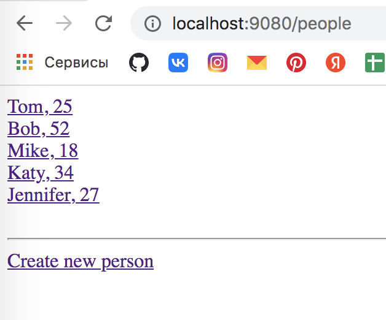

# Spring MVC (Валидация форм. Аннотация @Valid)

## Задание

1. Добавить валидацию полей.

## Решение

1. Добавляем `Person` поля `age` и `email`.
2. Меняем DAO, чтобы люди по-умолчанию создавались с новыми полями, + меняем метод `update`.
3. Меняем формы `new`, `edit` и немного корректируем отображение в представлениях `index` и `show`.
4. Запускаем:
   - `/people` 
   - `/people/4` 
   - `/people/4/edit` 
   - `/people/new` 
5. Добавляем зависимость для валидации - `Hibernate Validator Engine` (устанавливаем зависимость версии 6.1.6.Final, так как при более поздних версиях валидация перестает работать).
6. В классе `Person` будем устанавливать правила валидации с помощью аннотаций. Будем валидировать `name`, `age` и `email`.
   - `@NotEmpty` - чтобы не могло быть пустого значения;
   - `@Size` - количество вводимых символов (от и до);
   - `@Min` - устанавливает минимальное значение для числового поля;
   - `@Email` - проверяет формат.
7. В контроллере будем обрабатывать значения, приходящие с наших форм.
8. Добавляем `@Valid` в метод `create`, чтобы значения с формы валидировались. Далее в этот же метод добавляем объект `BindingResult`, в которой будет помещаться ошибка, если валидация не прошла. Этот объект должен идти всегда после той модели, которая валидируется (того класса, где аннотация `@Valid`). Именно в этот объект `BindingResult` будет внедрет объект с ошибками.
9. С помощью if'а проверяем наличие ошибок, если они есть - возвращаем форму создания заново. В этой форме будут ошибки, и эти ошибки будут отображаться с помощью Thymeleaf'а.
10. Делаем аналогичные действия для метода `update`.
11. Отредактируем наши представления.
12. Редактируем  `new` и `edit` - должны дописать код, которые  будет отображать ошибки валидации, если они есть.
    - используем механизм Thymeleaf'а, который можно использовать для любого HTML-тега, - `th:if`;
    - `Name error` в теге с механизмом никогда не будет видно - если нет ошибок, этот тег `
` не отобразится, если ошибки есть - перезапишется;
    - добавили красный цвет отображения ошибки;
13. Запускаем приложение:
    - `/people/new` 
    - не заполняем поля и жмем `Create!` 
    - вводим имя, но невалидный email, жмем `Create!` 
    - вводим валидное имя и емейл, но отрицательный возвраст,  жмем `Create!` 
    - вводим валидные значения во все поля, жмем `Create!` 
    - редактируем человека - `people/1/edit` 
    - вводим все невалидные значения, жмем `Update!` 
    - вводим валидные, жмем `Update!` 